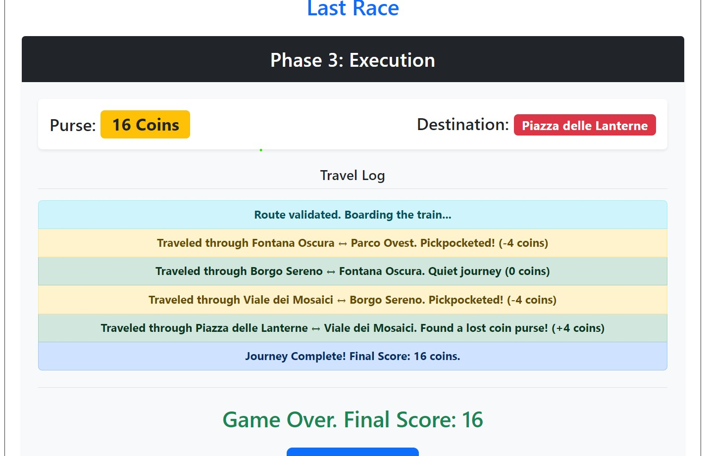
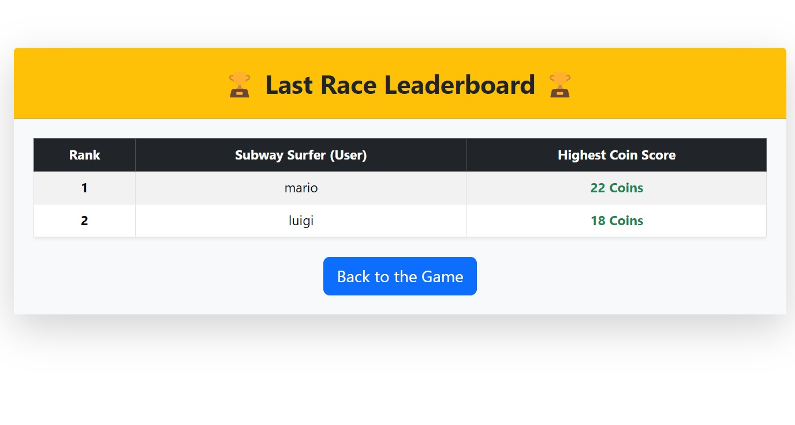

# Exam #1: "Last Race"
## Student: s353832 ZARRIN SAMAN 

## React Client Application Routes

- Route `/`: Welcome page. Displays game instructions to anonymous users and prompts them to log in to play.
- Route `/login`: The Authentication page. Contains the form for users to log in.
- Route `/game`: The Main Game Loop page. Handles Phase 1 (10s map memorization), Phase 2 (90s blind route planning), and Phase 3 (route execution with events).
- Route `/ranking`: The Leaderboard page. Displays the highest scores achieved by all registered users.

## API Server

- POST `/api/sessions`
  - request body content: `{"username": "mario", "password": "password1common"}`
  - response body content: `{ "id": 1, "username": "mario" }`
- GET `/api/sessions/current`
  - request parameters: None
  - response body content: `{ "id": 1, "username": "mario" }` (if logged in) or `401 Unauthorized`
- DELETE `/api/sessions/current`
  - request parameters: None
  - response body content: `{ "message": "Logged out successfully" }`
- GET `/api/stations`
  - request parameters: None
  - response body content: Array of station objects `[{ "id": 1, "name": "Centrale", "is_interchange": 1 }, ...]`
- GET `/api/segments`
  - request parameters: None
  - response body content: Array of segments `[{ "line_id": 1, "station_a": "Centrale", "station_b": "Porta Velaria" }, ...]`
- GET `/api/game/setup`
  - request parameters: None
  - response body content: `{ "startStation": "Centrale", "targetStation": "Viale dei Mosaici" }` (Guaranteed to be separated by at least 3 segments)
- GET `/api/events`
  - request parameters: None
  - response body content: Array of events `[{ "id": 1, "description": "Found a coin", "effect": 1 }, ...]`
- GET `/api/rankings`
  - request parameters: None
  - response body content: Array of user high scores `[{ "username": "mario", "best_score": 22 }, ...]`

## Database Tables

## Database Tables

- Table `users` - Stores registered user credentials for authentication (contains `id`, `username`, `salt`, `hash`).
- Table `lines` - Defines the different subway/metro lines (contains `id`, `name`).
- Table `stations` - Stores the individual stops and flags if they are transfer points (contains `id`, `name`, `is_interchange`).
- Table `segments` - Maps the connections between two stations to form the network graph (contains `id`, `line_id`, `station_a_id`, `station_b_id`).
- Table `events` - Contains the random positive or negative occurrences encountered during gameplay (contains `id`, `description`, `effect`).
- Table `games` - Tracks the match history and final scores for the leaderboard (contains `id`, `user_id`, `score`).

## Main React Components

- `Welcome` (in `Welcome.jsx`): Landing page detailing the game rules without rendering the map layout.
- `Login` (in `Login.jsx`): Form component handling user credentials and session initialization.
- `Game` (in `Game.jsx`): The core engine managing the 10s/90s timers, state transitions, route building logic, and step-by-step execution.
- `MetroMap` (in `MetroMap.jsx`): A dynamic SVG component that renders the complex network graph, capable of toggling the visibility of connection lines based on the game phase.
- `Ranking` (in `Ranking.jsx`): Podium component fetching and displaying the sorted maximum scores for all players.

## Screenshot

## Users Credentials

- username: **mario**, password: **password1common** - username: **luigi**, password: **password1common** - username: **peach**, password: **password1common** 
## Use of AI Tools
AI (Gemini) was utilized during the development of this project as a coding assistant. It was used to help map React state to dynamic SVG coordinates for the visual network graph and structure the database schemas.